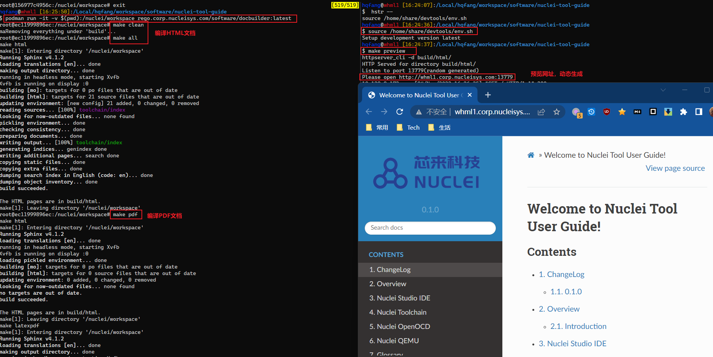
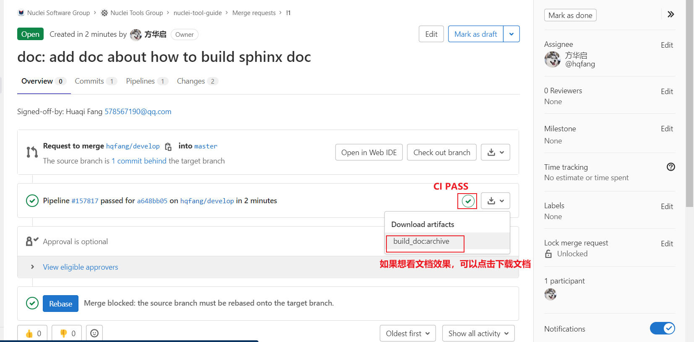

# 快速编译指南

## RST语言指南

参见[RST语法](https://wiki.corp.nucleisys.com/pages/viewpage.action?pageId=14296857#heading-5rst%E8%AF%AD%E6%B3%95%E7%BA%A6%E5%AE%9A)

## WHSS1/WHML1上编译开发

如果你是在whss1/whml1上工作，请在你自己的/Local目录下clone代码，修改完文档查看效果请执行如下命令来进行文档的编译。

~~~shell
# 当前已处于文档所在根目录下
podman run -it -v $(pwd):/nuclei/workspace rego.corp.nucleisys.com/software/docbuilder:latest
# 进入到docker 环境下
# 清理之前的编译
make clean
# 编译网页文档
make all
# 编译pdf文档
make pdf
~~~

如果需要预览文档效果，请新开一个shell环境，并运行如下命令

~~~shell
# 环境设置
source /home/share/devtools/env.sh
# 预览网页，在本地浏览器中打开预览的网址
make preview
~~~

效果图参见

## 发送merge request

文档开发请创建自己的开发分支例如, hqfang/develop, 如果开发完毕，就往master分支发送merge request，请求review，review完毕，CI PASS以后
就可以合入了。

# Prepare

Check [Nuclei Docker Environment](https://wiki.corp.nucleisys.com/pages/viewpage.action?pageId=4461320) to learn
about how to use podman in wuhan software environment.

The podman image we use is `rego.corp.nucleisys.com/software/docbuilder:latest`.

Here are the steps to get this image:

~~~shell
# login using your account, and passwd using CLI secret
podman login rego.corp.nucleisys.com
# Pull image
podman pull rego.corp.nucleisys.com/software/docbuilder:latest
~~~

# Build Document

Here are the steps to build the documentation:

~~~shell
# in host pc, run this podman image
podman run -it -v $(pwd):/nuclei/workspace rego.corp.nucleisys.com/software/docbuilder:latest
# in docker image now
# build html doc, html doc will be saved in build/html
make html
# build pdf doc, pdf doc will be saed in build/latex
make latexpdf
~~~
