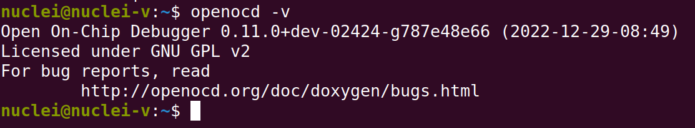

.. _openocd_intro:

Introduction
============

===================
OpenOCD quick start
===================

******************
Repository and doc
******************

source code git repository:

`github riscv-openocd <https://github.com/riscv-mcu/riscv-openocd/tree/nuclei/2023>`_

`gitee riscv-openocd <https://gitee.com/riscv-mcu/riscv-openocd/tree/nuclei/2023>`_

openflashloader

`github openflashloader <https://github.com/riscv-mcu/openflashloader>`_

`gitee openflashloader <https://gitee.com/riscv-mcu/openflashloader>`_

doc install path:

``openocd\doc\pdf\openocd.pdf``

***************
Common commands
***************

+++++++++++++++++++++++++++++++++++++++
How to determine the version of OpenOCD
+++++++++++++++++++++++++++++++++++++++

* start a cmd(Windows)/terminal(Linux)
* run the *openocd -v* command

.. note::

    git commit id: 787e48e66

    compile date: (2022-12-29-08:49)

+++++++++++++
Start OpenOCD
+++++++++++++

.. rubric:: Frequently used command line parameters

+------------+-------------------------------------------+
| parameter  | description                               |
+============+===========================================+
| -v         | display version info                      |
+------------+-------------------------------------------+
| -d         | set debug level to 3                      |
+------------+-------------------------------------------+
| -d0        | error messages only                       |
+------------+-------------------------------------------+
| -d1        | error warning                             |
+------------+-------------------------------------------+
| -d2        | error warning info (default)              |
+------------+-------------------------------------------+
| -d3        | error warning info debug                  |
+------------+-------------------------------------------+
| -d4        | error warning info debug  low-level-debug |
+------------+-------------------------------------------+
| -f file    | use configuration file                    |
+------------+-------------------------------------------+
| -s dir     | dir to search for config files            |
+------------+-------------------------------------------+
| -l logfile | redirect log output to logfile            |
+------------+-------------------------------------------+

+++++++++++++++
Nuclei addition
+++++++++++++++

.. rubric:: Display CPU information

Usually we don't know what instruction sets a CPU supports, what functional components it contains, and the various 
configurations of the components. The only way to get the desired information is to read the corresponding CSR registers 
and then do the math. It would be a pain in the ass to do this for every function point that needs to be known. This command 
is designed to solve this problem by automatically reading the CSRs and doing the math, and then formatting the output.

``nuclei cpuinfo``

.. rubric:: Nuspi(nucle spi) driver

Nuclei's SPI controller, used in Nuclei RISC-V fpga evaluation board and other boards.

``flash bank name nuspi base size chip_width bus_width target spi_base [simulation]``

.. rubric:: Custom driver and open-flashloader

Custom exists for compatibility with any SPI controller and any Flash. It also needs to be used in conjunction with 
openflashloader to achieve the desired results.

``flash bank name custom base size chip_width bus_width target spi_base flashloader_path [simulation] [sectorsize=]``

.. rubric:: Nuclei CSR

Nuclei released openocd supports a number of nuclei customized CSRs.

.. code-block:: c
    :linenos:

    /* === TEE CSR Registers === */
    #define CSR_SPMPCFG0 0x1a0
    #define CSR_SPMPCFG1 0x1a1
    #define CSR_SPMPCFG2 0x1a2
    #define CSR_SPMPCFG3 0x1a3
    #define CSR_SPMPADDR0 0x1b0
    #define CSR_SPMPADDR1 0x1b1
    #define CSR_SPMPADDR2 0x1b2
    #define CSR_SPMPADDR3 0x1b3
    #define CSR_SPMPADDR4 0x1b4
    #define CSR_SPMPADDR5 0x1b5
    #define CSR_SPMPADDR6 0x1b6
    #define CSR_SPMPADDR7 0x1b7
    #define CSR_SPMPADDR8 0x1b8
    #define CSR_SPMPADDR9 0x1b9
    #define CSR_SPMPADDR10 0x1ba
    #define CSR_SPMPADDR11 0x1bb
    #define CSR_SPMPADDR12 0x1bc
    #define CSR_SPMPADDR13 0x1bd
    #define CSR_SPMPADDR14 0x1be
    #define CSR_SPMPADDR15 0x1bf
    #define CSR_SMPUSWITCH0 0x170
    #define CSR_SMPUSWITCH1 0x171

    /* === Nuclei custom CSR Registers === */
    #define CSR_MILM_CTL 0x7c0
    #define CSR_MDLM_CTL 0x7c1
    #define CSR_MECC_CODE 0x7c2
    #define CSR_MNVEC 0x7c3
    #define CSR_MSUBM 0x7c4
    #define CSR_MDCAUSE 0x7c9
    #define CSR_MCACHE_CTL 0x7ca
    #define CSR_MMISC_CTL 0x7d0
    #define CSR_MSAVESTATUS 0x7d6
    #define CSR_MSAVEEPC1 0x7d7
    #define CSR_MSAVECAUSE1 0x7d8
    #define CSR_MSAVEEPC2 0x7d9
    #define CSR_MSAVECAUSE2 0x7da
    #define CSR_MSAVEDCAUSE1 0x7db
    #define CSR_MSAVEDCAUSE2 0x7dc
    #define CSR_MTLB_CTL 0x7dd
    #define CSR_MECC_LOCK 0x7de
    #define CSR_MFP16MODE 0x7e2
    #define CSR_LSTEPFORC 0x7e9
    #define CSR_PUSHMSUBM 0x7eb
    #define CSR_MTVT2 0x7ec
    #define CSR_JALMNXTI 0x7ed
    #define CSR_PUSHMCAUSE 0x7ee
    #define CSR_PUSHMEPC 0x7ef
    #define CSR_MPPICFG_INFO 0x7f0
    #define CSR_MFIOCFG_INFO 0x7f1
    #define CSR_MATTRI0_BASE 0x7f3
    #define CSR_MATTRI0_MASK 0x7f4
    #define CSR_MATTRI1_BASE 0x7f5
    #define CSR_MATTRI1_MASK 0x7f6
    #define CSR_MATTRI2_BASE 0x7f9
    #define CSR_MATTRI2_MASK 0x7fa
    #define CSR_MATTRI3_BASE 0x7fb
    #define CSR_MATTRI3_MASK 0x7fc
    #define CSR_MATTRI4_BASE 0x7fd
    #define CSR_MATTRI4_MASK 0x7fe
    #define CSR_MIRGB_INFO 0x7f7
    #define CSR_SLEEPVALUE 0x811
    #define CSR_TXEVT 0x812
    #define CSR_WFE 0x810
    #define CSR_JALSNXTI 0x947
    #define CSR_STVT2 0x948
    #define CSR_PUSHSCAUSE 0x949
    #define CSR_PUSHSEPC 0x94a
    #define CSR_SDCAUSE 0x9c0
    #define CSR_MICFG_INFO 0xfc0
    #define CSR_MDCFG_INFO 0xfc1
    #define CSR_MCFG_INFO 0xfc2
    #define CSR_MTLBCFG_INFO 0xfc3
    #define CSR_MECC_CTRL 0xbc0
    #define CSR_MECC_STATUS 0xbc4

    /* === P-Extension Registers === */
    #define CSR_UCODE 0x801

    /* === Nuclei CCM Registers === */
    #define CSR_CCM_MBEGINADDR 0x7cb
    #define CSR_CCM_MCOMMAND 0x7cc
    #define CSR_CCM_MDATA 0x7cd
    #define CSR_CCM_SUEN 0x7ce
    #define CSR_CCM_SBEGINADDR 0x5cb
    #define CSR_CCM_SCOMMAND 0x5cc
    #define CSR_CCM_SDATA 0x5cd
    #define CSR_CCM_UBEGINADDR 0x4cb
    #define CSR_CCM_UCOMMAND 0x4cc
    #define CSR_CCM_UDATA 0x4cd
    #define CSR_CCM_FPIPE 0x4cf

    /* === Nuclei Supervisor Registers === */
    #define CSR_SATTRI0_BASE 0x5f0
    #define CSR_SATTRI0_MASK 0x5f1
    #define CSR_SATTRI1_BASE 0x5f2
    #define CSR_SATTRI1_MASK 0x5f3
    #define CSR_SATTRI2_BASE 0x5f4
    #define CSR_SATTRI2_MASK 0x5f5
    #define CSR_SATTRI3_BASE 0x5f6
    #define CSR_SATTRI3_MASK 0x5f7
    #define CSR_SATTRI4_BASE 0x5f8
    #define CSR_SATTRI4_MASK 0x5f9
    #define CSR_SATTRI5_BASE 0x5fa
    #define CSR_SATTRI5_MASK 0x5fb
    #define CSR_SATTRI6_BASE 0x5fc
    #define CSR_SATTRI6_MASK 0x5fd
    #define CSR_SATTRI7_BASE 0x5fe
    #define CSR_SATTRI7_MASK 0x5ff

    /* === Nuclei Stack Checker Registers === */
    #define CSR_MSTACK_CTRL 0x7c6
    #define CSR_MSTACK_BOUND 0x7c7
    #define CSR_MSTACK_BASE 0x7c8

.. rubric:: Nuclei embedded trace

Some Nuclei cpus are equipped with trace support, which permits examination of the instruction activity. Trace 
activity is controlled through an Embedded Trace(Etrace) Module on the core's scan chains. The following 
commands are for etrace.

``nuclei etrace config etrace-addr buffer-addr buffer-size wrap``

This command is used to initialize Etrace and configure related parameters.

``nuclei etrace enable``

This command triggers the Etrace enable signal by setting the Core internal trigger.

``nuclei etrace disable``

This command triggers the Etrace disable signal by setting the Core internal trigger.

``nuclei etrace start``

This command is used to enable Etrace data collection.

``nuclei etrace stop``

This command is used to disable Etrace data collection.

``nuclei etrace dump filename``

This command is used to dump the data captured by Etrace.

``nuclei etrace clear``

This command is used to clear the read and write pointers for Etrace.

``nuclei etrace info``

This command displays the current Etrace status.

.. rubric:: Init resethalt command

In practice, usually encountered due to software problems caused by the CPU stuck, then the debugger will not 
be connected to the development board, only to the development board power off. If your code is running in 
flash, powering down the board will not solve the problem. resethalt is designed to solve this problem.

``init resethalt``

.. rubric:: Ftdi nscan1_mode command

Enable or disable Nuclei CJTAG mode. Usage is the same as ftdi oscan1_mode.

``ftdi nscan1_mode on|off``

*****************************
Modify the configuration file
*****************************

The openocd configuration file is used to configure how to connect to the development board's window 
through the Debug interface. nuclei provides an example of the openocd configuration file, which can 
be modified based on the example.

.. rubric:: Modify debugger rate

``adapter_khz 1000`` or ``adapter speed 1000``

.. rubric:: Modify debugger mode

There are two debugging modes JTAG and cJATG.

* JTAG <-> ``ftdi nscan1_mode off``

* cJTAG <-> ``ftdi nscan1_mode on``

.. rubric:: Describe the JTAG link

* single core

.. code-block:: c
    :linenos:

    set _CHIPNAME0 riscv0
    jtag newtap $_CHIPNAME0 cpu -irlen 5 -expected-id 0x10900a6d

    set _TARGETNAME0 $_CHIPNAME0.cpu
    target create $_TARGETNAME0 riscv -chain-position $_TARGETNAME0 -coreid 0

* smp system

.. code-block:: c
    :linenos:

    set _CHIPNAME0 riscv0
    jtag newtap $_CHIPNAME0 cpu -irlen 5 -expected-id 0x10900a6d

    set _TARGETNAME0 $_CHIPNAME0.cpu
    target create $_TARGETNAME0.0 riscv -chain-position $_TARGETNAME0 -coreid 0 -rtos hwthread
    target create $_TARGETNAME0.1 riscv -chain-position $_TARGETNAME0 -coreid 1
    target create $_TARGETNAME0.2 riscv -chain-position $_TARGETNAME0 -coreid 2
    target smp $_TARGETNAME0.0 $_TARGETNAME0.1 $_TARGETNAME0.2

* amp system

.. code-block:: c
    :linenos:

    set _CHIPNAME0 riscv0
    jtag newtap $_CHIPNAME0 cpu -irlen 5 -expected-id 0x10900a6d

    set _CHIPNAME1 riscv1
    jtag newtap $_CHIPNAME1 cpu -irlen 5 -expected-id 0x10300a6d

    set _TARGETNAME0 $_CHIPNAME0.cpu
    target create $_TARGETNAME0 riscv -chain-position $_TARGETNAME0 -coreid 0

    set _TARGETNAME1 $_CHIPNAME1.cpu
    target create $_TARGETNAME1.0 riscv -chain-position $_TARGETNAME0 -coreid 0 -rtos hwthread
    target create $_TARGETNAME1.1 riscv -chain-position $_TARGETNAME0 -coreid 1
    target smp $_TARGETNAME1.0 $_TARGETNAME1.1

.. note::

    * ``-rtos hwthread``

    OpenOCD includes a pseudo RTOS called hwthread that presents CPU cores ("hardware
    threads") in an SMP system as threads to GDB. With this extension, GDB can be used to
    inspect the state of an SMP system in a natural way. After halting the system, using the
    GDB command info threads will list the context of each active CPU core in the system.
    GDB's thread command can be used to switch the view to a different CPU core. The step
    and stepi commands can be used to step a specific core while other cores are free-running
    or remain halted, depending on the scheduler-locking mode configured in GDB.

.. rubric:: Describe the workarea

workarea is mainly used to speed up certain operations, such as reading and writing large 
chunks of memory, running small program fragments, reading and writing flash, and so on.

.. code-block:: c
    :linenos:

    $_TARGETNAME0.0 configure -work-area-phys 0x08000000 -work-area-size 0x10000 -work-area-backup 1

.. note::

    The workarea should be a readable, writable, and executable area of memory.

    ``0x08000000`` workarea base address, modified according to the actual situation.

    ``0x10000`` workarea size of byte, modified according to the actual situation.

.. rubric:: Describe the nor flash

.. code-block:: c
    :linenos:

    set _FLASHNAME0 $_CHIPNAME0.flash
    flash bank $_FLASHNAME0 nuspi 0x20000000 0 0 0 $_TARGETNAME0.0 0x10180000

.. note::

    ``nuspi`` openocd flash drivers type, modified according to the actual situation.

    ``0x20000000`` qspi-xip address, modified according to the actual situation.

    ``0x10180000`` qspi controller base address, modified according to the actual situation.

.. rubric:: Connect to the specified debugger

When there is more than one debugger in a debugging environment, we need to connect to 
specify the debugger, in this case you can use the following command to specify.

.. code-block:: c
    :linenos:

    ftdi_serial FT4YR31I

.. rubric:: How to set up gdb/telnet/tcl ports

openocd provides three kinds of debugging service ports are gdb/telnet/tcl, choose 
the appropriate service according to the situation, and set the port number of the 
corresponding service by the following command.

.. code-block:: c
    :linenos:

    gdb_port 3333
    telnet_port 4444
    tcl_port 6666

.. note::

    The above shows the default port number, you are free to change the port number 
    if it is free. Of course we can also disable the port numbers we don't need, it's 
    easy just change the port number to `disable`.

.. rubric:: semihosting

OpenOCD also supports the ARM semihosting feature, use the following command to enable it.

.. code-block:: c
    :linenos:

    arm semihosting enable

**************************
Frequently asked questions
**************************

There are a few more FAQs please see: ``https://github.com/riscv-mcu/riscv-openocd/wiki``

********************************
Low-cost commissioning solutions
********************************

Nuclei Dlink: ``https://github.com/Nuclei-Software/nuclei-dlink``

****************
Revision history
****************

.. rubric:: 2023.10

This is release 2023.10 of openocd.

* target/riscv:add etrace command and driver
* target/riscv:add nuclei cpuinfo command
* jtag/drivers:ftdi add nscan1_mode
* server/gdb-server:fix flash operation error when addr-width > 32bit on windows
* target/riscv:fix smp flash write fail bug
* doc:add doc for nuclei openocd
* upstream https://github.com/riscv/riscv-openocd commit 28f630d24568fb3518723349df60bcd30b68bf7b

.. rubric:: 2022.12

This is release 2022.12 of openocd.

* nor/spi:add w25q512jv
* add 'init resethalt' command
* feature:auto search custom flashloader path
* fix riscv-debug v0.11 call riscv_run_algorithm error

.. rubric:: 2022.08

This is release 2022.08 of openocd.

* spi_nor:add xt25f256b mac25l1633e gd25q80b gd25le32e en25s40a by25q32al fm25q128 gd25B512me.
* custom flashloader don't rely on 'src/flash/nor/spi.c', fix memory leaks bug.
* upstream https://github.com/riscv/riscv-openocd commit 52177592f9d3afc6a008f8e1b321cf74e823018f

.. rubric:: 2022.04

This is release 2022.04 of openocd.

* add DSP ucode csr register
* Adjustment simulation timeout param
* Fix after write_bank/write_image command read date error bug
* Add custom flash loader in openocd, please refer wiki for how to use it
* Custom flash loader: add 'simulation' parameter for simulation test

.. rubric:: 2022.01

This is release 2022.01 of openocd.
 
* optimize cjtag support for nuclei cjtag
* spi_nor: add BoHong bh25d80a bh25d40a bh25d20a
* spi_nor: Add Micron MT25QU512
* flash:"flash bank" command add simulation param
* add nuclei all custom csr
* spi_nor: Add MXIC MX25U51245G
* transport/ftdi: Update to new standard cJTAG sequence
* flash: add XinSheng RISC-V MCU CM32M4xxR flash program driver
* Add nuspi loader support.
* Add nuspi SPI flash driver support.
* Enable multi-core debug.
* Previous fespi loader will be rerouted to nuspi loader.
* upstream https://github.com/riscv/riscv-openocd commit 6edf98db7f98c5e24bc51cf98419bdf5bbc530e6
